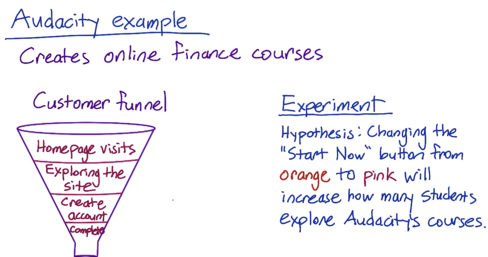

Experimentation:

ranging from the underlying infrastructure, to design metrics and dashboards, to running and analyzing experiments to the processing culture needed to facilitate data-driven solutions

## What is `A/B testing`?

A/B testing is a general methodology used online when you wanna test out a new product or a feature. And what you're doing is you are going to take two sets of users and you will show one set, a control set, your existing prduct or feature, and then another set, your experiment, the new version.

Then, you will examine how did these users from two groups respond differently in order to intermine which version of your feature is better.

- Example:
    - It can be a novel big change or addition in product or feature like when Amazon initially decided to launch their first personalized product recommendations feature based on A/B testing results that showed a huge increase in revenue by adding this new feature.

    - It can also be a very small or trivial feature such as when Google tested 41 different shades of blue.

- **The key thing in A/B testing** is that you have a `consistent response` from your control and experiment group so that you can actually `determine and structure the experiment` to determine whether there is `a significant behavior change` in your experiment group.

- **The goal in A/B testing** is to design an experiment that is gonna be `robust` and give you `repeatable results` so that you can actually make a good decision about whether or not to actually launch that product or feature.

- **A/B Testing compared to hypothesis testing in traditional fields of study**: In traditional fields of study such as clinical trials in psychology or medical research, we know a lot of information about participants such as their demographics, and we usually have a relatively small number of participants. However, when testing an `online` product, we might have millions of users, hundreds or thousands of clicks, etc., and we DO NOT know much about who is taking those actions on the other end.

## What you can't do with A/B testing?

### I. Case 1: New Experiences (e.g. premium service that offers additional functionality)
(p.s. to access premium, user need to upgrade, create a log-in, and explore new functionality)

- A/B testing isn't useful when you wanna test out `new experiences`. Because when you are testing a new experience, you have an existing set of users and they might feel that you have changed their experience and they preferred their old way (and this is `change aversion`). The other case is that they can be really like this new experience and they test out everything (this is called a `novelty effect`). What happens in a new experience are two issues:
    1. we are not sure about the baseline for comparison
    2. we can't control the exact time we need in order to actually have our users adapt to the new experience. So that we can't know the plateaued experience so that we can actually make a robust decision.

### II. Case 2: Time-dependent/related cases (e.g. Referal)
- For example, if we have a website that recommends apartment rentals, but people don't look for apartments that often, what you really want is to grow your business by referrals to other people who like your service. The main issues in this case are:
    1. The scope of an experiment will be really hard to measure whether people `actually` come back to you from more referrals or from other reasons.
    2. We can't estimate the time that people actually spend in making the action of referral happen. 

### III. Cases 3: Missing/Complete content or services
- A/B testing can't really tell us if we are missing something. For example, if we are building a song or a book reviews website, A/B testing can't tell us if we are missing the entire other book that we should be reviewing but we aren't reviewing at all.

## Other Techniques:
- **Qualitative research:** A/B testing can give you a lot of broad quantitative data, but other techniques give you very deep and qualitative data that are really complimentary to A/B testing
    - User experience research
    - Focus groups and surveys
    - Human evaluations

- **Quantitative approach**: We can also analyze the `logs` of what users did on the website to see if a hypotheis can be developed about what's `causing` changes in their behavior. And that's sth where you may want to go forward and actually design and randomize an experiment through a perspective analysis. We can use the two data sources to compliment each other.

## Example: Audacity

### Defining the hypothesis
Initial hypothesis: 
